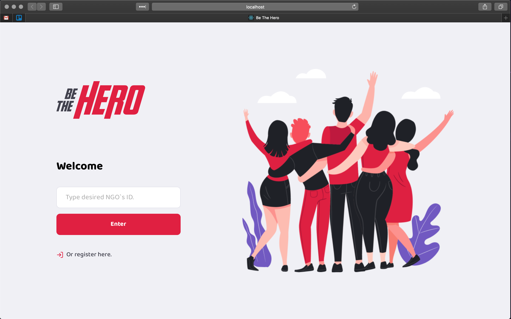
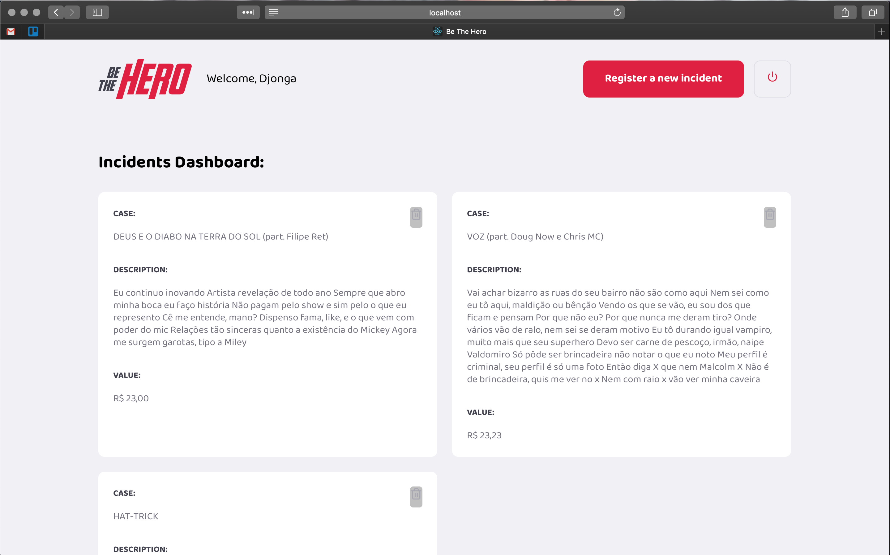

# Omnistack11: beTheHero

Project of a voluntary plataform that connects users & NGO's. This is another learning project, to test my own capacity of developing in *JavaScript* and its vast _developer_ environment. 

This is also part of the Omnistack 11.0, and it got there a basic structure that I intend to developer even more with some properties I find useful or want to prove some concepts.

## Using

To use it `clone` this repository, then navigate into `/backend` directory, and type in your Terminal:
```
npm start
```
After this, at directory `/web`, also initiate server with:
```
npm start
```
Then you can navigate with your choosen browser to `https://localhost:3000` 

## Printscreens
- Login screen:


- Dashboard:

## Structure

```shell
|beTheHero
├── backend
│   ├── app.js + server.js
│   ├── route.js
│   ├── /controllers
│   ├── /database
│   ├── /utils
│   ├── package.json (express, ...)
│   ├── knexfile.js
│   └── jest.config.js
├── web
│   ├── src
│   │   ├── App.js
│   │   ├── global.css
│   │   ├── index.js
│   │   ├── routes.js
│   │   ├── /pages
│   │   ├── /services
│   │   └── /assets
│   ├── package.json (cra, ...)
├── README.md (this!)
└── LICENSE: MIT
```